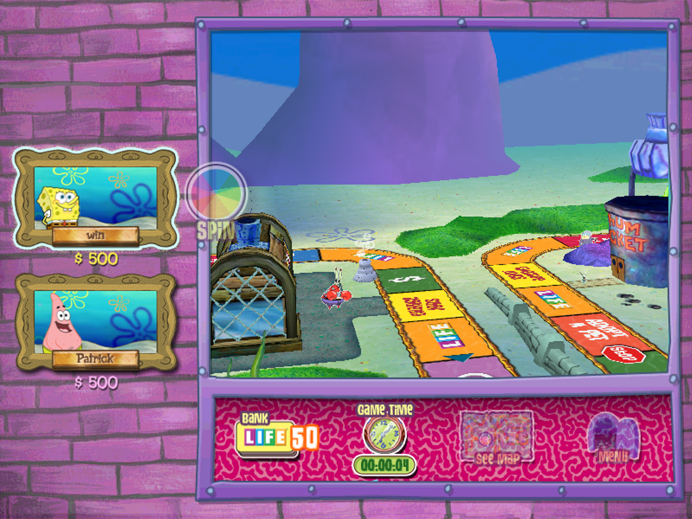
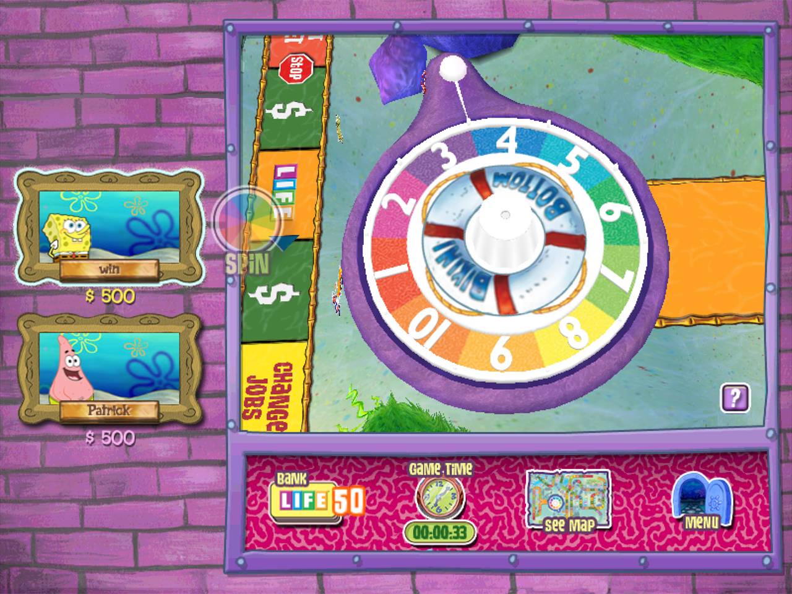
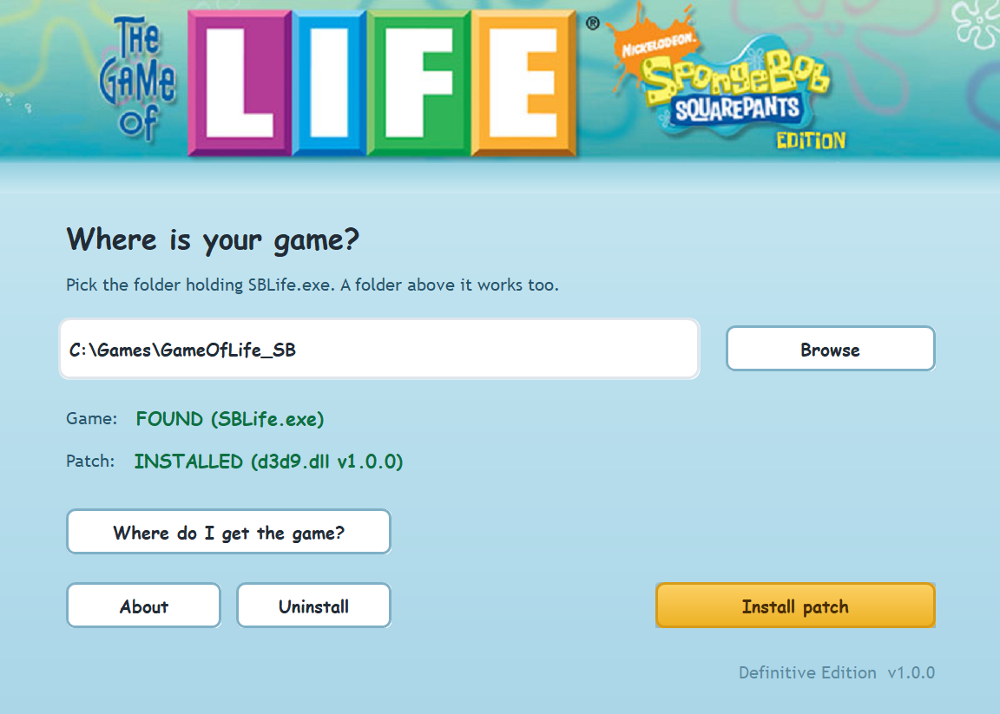
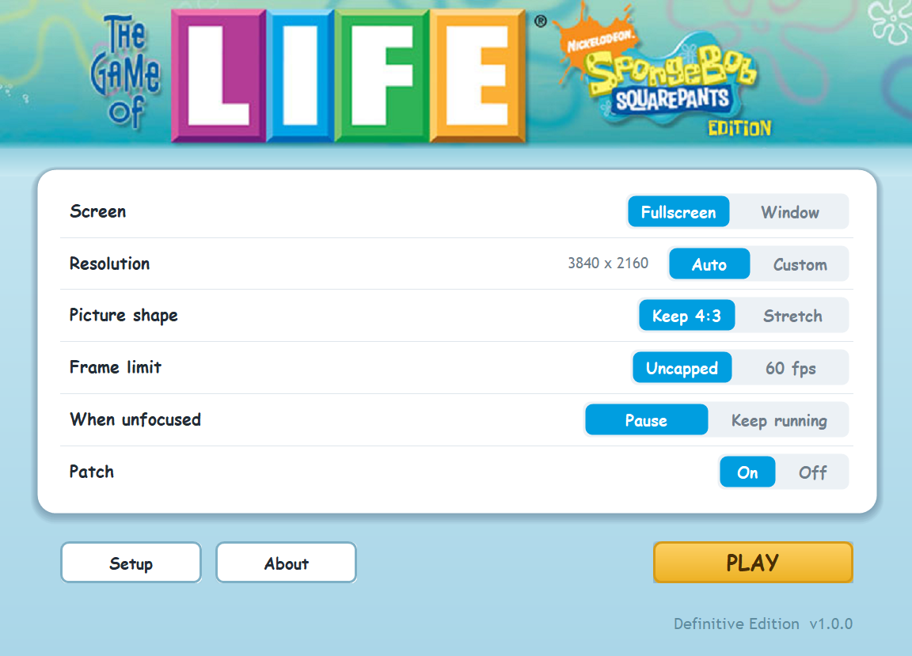

# The Game of Life: SpongeBob SquarePants Edition - Definitive Edition

A patch that runs the 2007 PC game at your monitor's resolution instead of 800x600.

| The board | The spinner |
|---|---|
| [](screenshots/game-board.png) | [](screenshots/game-spinner.png) |

## What it does

- Fullscreen without switching your display mode, so alt-tab still works
- Keeps the picture's original shape, with black bars at the sides
- Windowed mode if you prefer it
- Changes no game file. Uninstall removes everything it added

## Installing

You need your own copy of the game. See [Getting the game](#getting-the-game).

1. Run `GameOfLifeDefinitiveEdition.exe`
2. Point it at your game folder and click **Install patch**
3. It puts a launcher in the game folder. Use that to play and to change settings

| Setup | Launcher |
|---|---|
| [](screenshots/launcher-setup.png) | [](screenshots/launcher-settings.png) |

To remove it, open Setup and click **Uninstall**.

### If you already use ReShade, dgVoodoo2, SpecialK or ENB

This installs as `d3d9.dll`, the same filename all of those use, and only one can exist in a folder. The installer asks before replacing one, and Uninstall will not delete a `d3d9.dll` that did not come from this patch. Copying files in by hand skips those checks.

## Settings

| Setting | Options | Default | Notes |
|---|---|---|---|
| Screen | Fullscreen / Window | Fullscreen | Fullscreen keeps your desktop resolution |
| Resolution | Auto / Custom | Auto | Custom reveals width and height fields |
| Picture shape | Keep 4:3 / Stretch | Keep 4:3 | Stretch fills a widescreen monitor but distorts it |
| Frame limit | Uncapped / 60 fps | Uncapped | Not needed, but here if you want it |
| When unfocused | Pause / Keep running | Pause | Minimising always pauses, either way |
| Patch | On / Off | On | Off runs the game exactly as it shipped |

Settings are saved to `GameOfLifeDefinitiveEdition.ini` beside the game. Two keys have no row in the launcher: `Method=runtime` falls back to a simpler way of scaling the picture if it comes out wrong on your hardware, and `Filter=point` turns off smoothing so every original pixel becomes a hard block.

## Secret card codes

Enter these at Main Menu > Profile > Bonus Cards > Enter Code.

| Code | Unlocks | Type | Value |
|---|---|---|---|
| `THINKHAPPY` | Jellyfish Hunter | Job | $700 |
| `BESTDAY` | Patrick's Rock | Home | $400 |
| `LUCKYDAY` | Gary | Pet | $500 |

No spaces, and case does not matter. The other three special cards (Trailer, Artist, Bubble Buddy) have no code and are earned by playing. [SPECIAL_CARD_CODES.md](SPECIAL_CARD_CODES.md) has the details.

## Developer cheats

The game shipped with its debug keys left in. Nothing to enable.

| Key | Effect |
|---|---|
| `F1` | Set the current player's cash to $100,000 |
| `Left Shift + F1` | Set the current player's cash to $0 |
| `F2` | Set the life tiles available in the bank to 50 |
| `Left Shift + F2` | Set the life tiles available in the bank to 0 |
| `F3` | Give the current player 1 life tile |
| `Left Shift + F3` | Take 1 life tile from the current player |
| `F4` | Turn every Spin Again tile into a secret path entrance |

While the spinner instruction popup is up, the number keys `1` to `0` move you that many spaces, where `0` is ten.

All of the above are tested. The game's own cheat list also names `LShift+R` and `LShift+E`, but neither does anything here and the schematic contains no code for them, so they are left out.

## Getting the game

The game was sold on CD in 2007 and is long out of print. This patch does not include it.

A disc image is preserved on the Internet Archive:

<https://archive.org/details/game-of-life-sb>

188,571,648 bytes, SHA-256 `187c45ac3d940b74b340ac9a5abb8d0a9b430686be856e6510a552c07f8cf9ec`.

Mount or extract it and run the installer inside.

## Building

Visual Studio 2017 or newer with the 32-bit C++ toolchain, because `SBLife.exe` is 32-bit.

```bat
build.bat
```

Produces `build\d3d9.dll` and `build\GameOfLifeDefinitiveEdition.exe`.

## Credits

This patch is MIT licensed. See [LICENSE](LICENSE).

*The Game of Life: SpongeBob SquarePants Edition* (c) 2007 THQ / Nickelodeon / Hasbro. No game code or artwork is included here. See [NOTICE](NOTICE).
